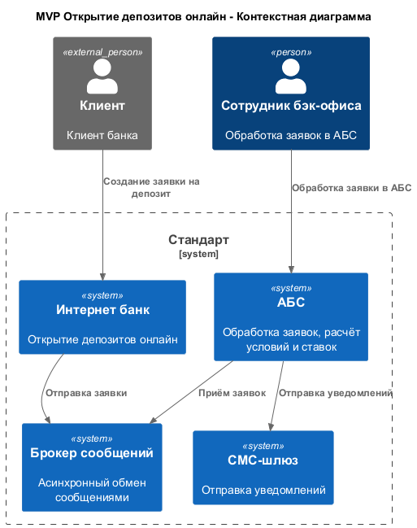
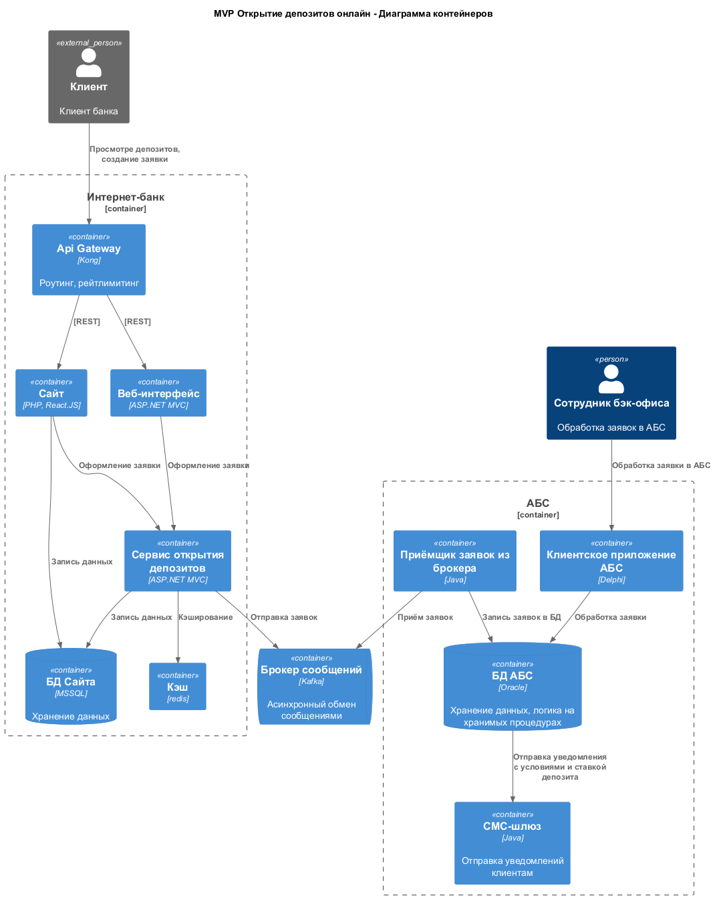

### **Название задачи:** MVP открытия депозитов онлайн
### **Автор:** Команда цифровой трансформации
### **Функциональные требования**

| **№** | **Действующие лица или системы** | **Use Case**                              | **Описание**                                                                          |
|-------|----------------------------------|-------------------------------------------|---------------------------------------------------------------------------------------|
| 1     | Клиент                           | Просмотр списка депозитов                 | Клиент просматривает список доступных для оформления депозитов с актуальными ставками |
| 2     | Клиент                           | Оформление заявки на сайте                | Клиент оформляет заявку, заполняя ФИО и номер телефона                                |
| 3     | Клиент                           | Открытие депозита онлайн в интернет банке | Клиент оформляет заявку и подтверждает её с помощью смс-кода                          |
| 4     | Сотрудник бэк-офиса              | Обработка заявки на открытие депозита     | Подтверждение условий заявки в АБС                                                    |
| 5     | Смс-шлюз                         | Отправка уведомлений                      | Отправка уведомлений клиенту об условиях и ставке депозита                            |

### **Нефункциональные требования**

| **№** | **Требование**                                                               |
|-------|------------------------------------------------------------------------------|
| 1     | Шифрование ПДн и чувствительной информации                                   |
| 2     | Отзывчивость интерфейса, время отклика <100 мс                               |
| 3     | Доступность 99,9%                                                            |
| 4     | Распределение нагрузки между ЦОД, переключение при сбоях                     |
| 5     | Использование существующих БД MSSQL, Oracle                                  |
| 6     | Использование технологий совместимых с существующим стеком React, Java, .NET |

### **Решение**

При построении архитектуры были учтены требования:
- Использование существующих технологий и БД для совместимости
- Асинхронное непрямое взаимодействие с АБС
- Использование Api Gateway и кэширования для снижения нагрузки и обеспечения доступности

### **Альтернативы**

Альтернатива 1: Прямая интеграция интернет-банка / сайта с АБС
Преимущества:
- Простота и скорость реализации
Недостатки:
- Потенциально выскоая нагрузка на АБС, приводящая к потере отказам в работе

Альтернатива 2: Переработка АБС и переход на более простой стек
Преимущества:
- Легкость поддержки
- Горизонтальное масштабирование
Недостатки:
- Высокие временные и денежные затраты

**Недостатки выбранного решения**:
- Использование устаревших технологий
- Большая часть логики работы АБС остаётся в виде хранимых процедур
- Брокер - дополнительная точка отказа

**Ограничения**:
- Отсутствие горизонтального масштабирования АБС
- Желание использовать существующие технологии

**Риски**:
- Увеличение сложности поддержки инфраструктуры
- Отказ АБС при внезапном повышении нагрузки
- Неконсистентность данных между Интернет-банком и АБС

