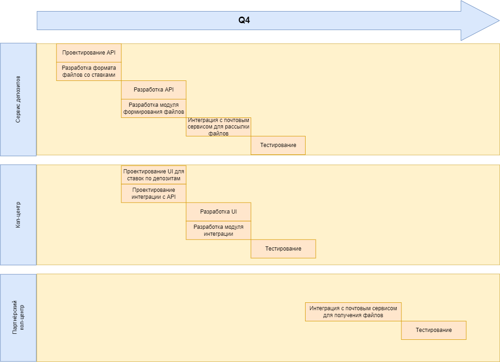
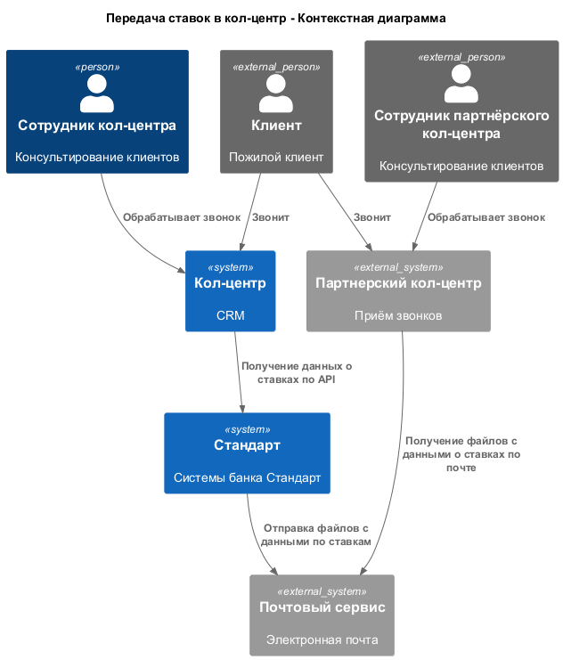
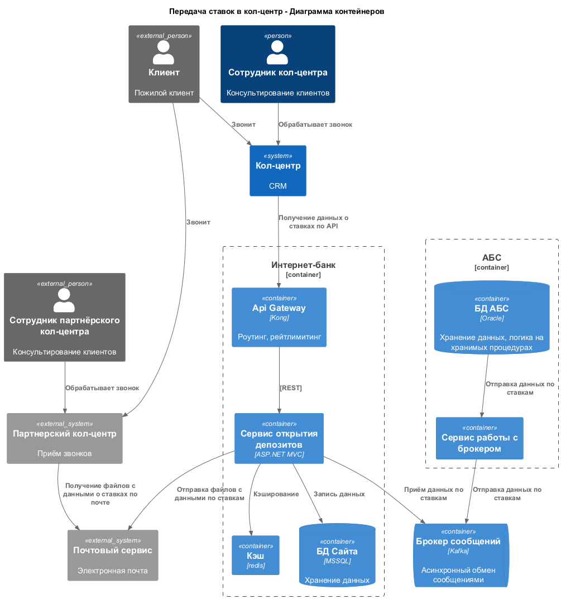

### **Название задачи:** Передача ставок в кол-центр
### **Автор:** Команда цифровой трансформации
### **Функциональные требования**

| **№** | **Действующие лица или системы**  | **Use Case**                              | **Описание**                                                                                           |
|-------|-----------------------------------|-------------------------------------------|--------------------------------------------------------------------------------------------------------|
| 1     | Клиент                            | Звонок в банк                             | Клиент звонит банк проконсультироваться по открытию депозитов                                          |
| 2     | Сотрудник кол-центра              | Консультирование по открытию депозитов    | Сотрудник кол-центра просматривает данные по ставкам в своей CRM                                       |
| 3     | Сотрудник партнерского кол-центра | Консультирование по открытию депозитов    | Сотрудник внешнего кол-центра получает рассылку файлов с актуальными ставкам по почте                  |
| 4     | Сервис депозитов                  | Актуализация и рассылка данных по ставкам | Сервис обновляет данные по ставкам, после обновление осуществляет рассылку файлов со ставками по почте |
| 5     | АБС                               | Расчёт ставок                             | АБС рассчиитывает ставки и передаёт их в сервис депозитов                                              |

### **Нефункциональные требования**

| **№** | **Требование**                                                     |
|-------|--------------------------------------------------------------------|
| 1     | Отсутствие чувствительной информации в публичных данных по ставкам |
| 2     | Рассылка данных по ставкам после каждого обновление                |
| 3     | Доступность 99% для API получения данных по ставкам                |
| 4     | Обновление данных каждые 5 минут                                   |
| 5     | Доступ только к публичным данным для сотрудников кол-центра        |

### **Решение**

При построении архитектуры были учтены требования:
- Использование существующих технологий и БД для совместимости
- Асинхронное непрямое взаимодействие с АБС
- Использование Api Gateway и кэширования для снижения нагрузки и обеспечения доступности

### **Альтернативы**

Альтернатива 1: Разработка единого сервиса интеграции с системами кол-центра и внешнего кол-центра
Преимущества:
- Простота использования
- Расширенные возможности
Недостатки:
- Сложность и большое время разработки

**Недостатки выбранного решения**:
- Использование устаревших технологий
- Зависимость от внешних систем

**Ограничения**:
- Только файловый обмен с партнёрским кол-центром

**Риски**:
- Сбои и не актуальность данных на стороне внешних систем
